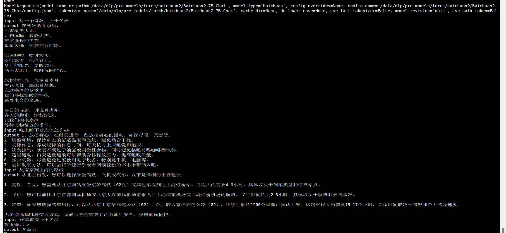
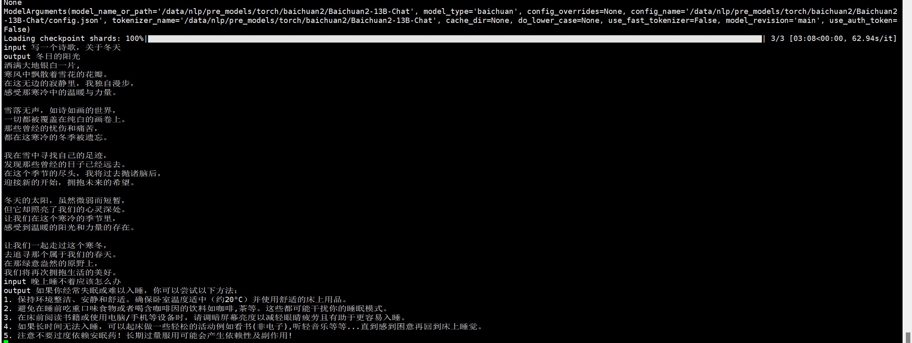

## update information
   - [deep_training](https://github.com/ssbuild/deep_training)

```text
    10-09 support accelerator trainer
    10-07 support colossalai trainer
    09-26 support transformers trainer
    09-15 deep_training >= 0.2.2.post4
    09-08 fix baichuan ptv2
    09-06 整合baichuan finetuning ,  support baichuan2 finetuning
```
   

## install
  - pip install -U -r requirements.txt
  - 如果无法安装， 可以切换官方源 pip install -i https://pypi.org/simple -U -r requirements.txt


```text
dev 通过一下方式安装 , 注意顺序
pip uninstall aigc_zoo
pip install -U git+https://github.com/ssbuild/aigc_zoo#egg=aigc_zoo
```


## v1 weight
- [Baichuan-13B-Base](https://huggingface.co/baichuan-inc/Baichuan-13B-Base)
- [Baichuan-13B-Chat](https://huggingface.co/baichuan-inc/Baichuan-13B-Chat)
- [baichuan-13b-chat-int4](https://huggingface.co/ssbuild/baichuan-13b-chat-int4)

## v2 weight
- [Baichuan2-7B-Chat](https://huggingface.co/baichuan-inc/Baichuan2-7B-Chat)
- [Baichuan2-7B-Base](https://huggingface.co/baichuan-inc/Baichuan2-7B-Base)
- [baichuan2-7b-chat-int4](https://huggingface.co/ssbuild/baichuan2-7b-chat-int4)
- 
- [Baichuan2-13B-Chat](https://huggingface.co/baichuan-inc/Baichuan2-13B-Chat)
- [Baichuan2-13B-Base](https://huggingface.co/baichuan-inc/Baichuan2-13B-Base)
- [baichuan2-13b-chat-int4](https://huggingface.co/ssbuild/baichuan2-13b-chat-int4)


## data sample
   open data https://github.com/ssbuild/open_data
    
单条数据示例

```text
p prefix  optional
q question optional
a answer   must

```
```json
 {
    "id": 0, 
    "p": "我是qwen训练的模型",
    "paragraph": [
        {
           "q": "你好",
           "a": "我是机器人，有什么可以帮助你的？"
        },
         {
             "q": "从南京到上海的路线",
             "a":  "你好，南京到上海的路线如下：1. 南京到上海，可以乘坐南京地铁1号线，在南京站乘坐轨道交通1号线。2. 南京到浦东机场，可以搭乘上海地铁1号，在陆家嘴站乘坐地铁1线，在浦东国际机场站乘坐机场快线，前往上海浦东国际机场。3. 上海到南京，可以换乘上海地铁2号线，从南京站换乘地铁2线，再从南京南站换乘地铁1路，然后到达上海站"
         }
     ]
 }

```

或者

```json
 {
    "id": 0,
    "conversations": [
      {
        "from": "system",
        "value": "我是qwen训练的模型"
      },
      {
        "from": "user",
        "value": "你好"
      },
      {
        "from": "assistant",
        "value": "我是机器人，有什么可以帮助你的？"
      },
      {
        "from": "user",
        "value": "从南京到上海的路线"
      },
      {
        "from": "assistant",
        "value": "你好，南京到上海的路线如下：1. 南京到上海，可以乘坐南京地铁1号线，在南京站乘坐轨道交通1号线。2. 南京到浦东机场，可以搭乘上海地铁1号，在陆家嘴站乘坐地铁1线，在浦东国际机场站乘坐机场快线，前往上海浦东国际机场。3. 上海到南京，可以换乘上海地铁2号线，从南京站换乘地铁2线，再从南京南站换乘地铁1路，然后到达上海站"
      }
     ]
 }
```


## infer
    # infer_finetuning.py 推理微调模型
    # infer_lora_finetuning.py 推理微调模型
    # infer_ptuning.py 推理p-tuning-v2微调模型
     python infer_finetuning.py



## training
```text
    # 制作数据
    cd scripts
    bash train_full.sh -m dataset 
    or
    bash train_lora.sh -m dataset 
    or
    bash train_ptv2.sh -m dataset 
    
    注: num_process_worker 为多进程制作数据 ， 如果数据量较大 ， 适当调大至cpu数量
    dataHelper.make_dataset_with_args(data_args.train_file,mixed_data=False, shuffle=True,mode='train',num_process_worker=0)
    
    # 全参数训练 
        bash train_full.sh -m train
        
    # lora adalora ia3 
        bash train_lora.sh -m train
        
    # ptv2
        bash train_ptv2.sh -m train
```
   
## 训练参数
[训练参数](args.MD)

## 友情链接

- [pytorch-task-example](https://github.com/ssbuild/pytorch-task-example)
- [tf-task-example](https://github.com/ssbuild/tf-task-example)
- [chatmoss_finetuning](https://github.com/ssbuild/chatmoss_finetuning)
- [chatglm_finetuning](https://github.com/ssbuild/chatglm_finetuning)
- [chatyuan_finetuning](https://github.com/ssbuild/chatyuan_finetuning)
- [llm_finetuning](https://github.com/ssbuild/llm_finetuning)
- [rlhf_llm](https://github.com/ssbuild/rlhf_llm)
- [rlhf_chatglm](https://github.com/ssbuild/rlhf_chatglm)
- [rlhf_chatyuan](https://github.com/ssbuild/rlhf_chatyuan)
- [rwkv_finetuning](https://github.com/ssbuild/rwkv_finetuning)
- [baichuan_finetuning](https://github.com/ssbuild/baichuan_finetuning)
- [baichuan2_finetuning](https://github.com/ssbuild/baichuan2_finetuning)

## 
    纯粹而干净的代码

## Star History

[](https://star-history.com/#ssbuild/baichuan2_finetuning&Date)